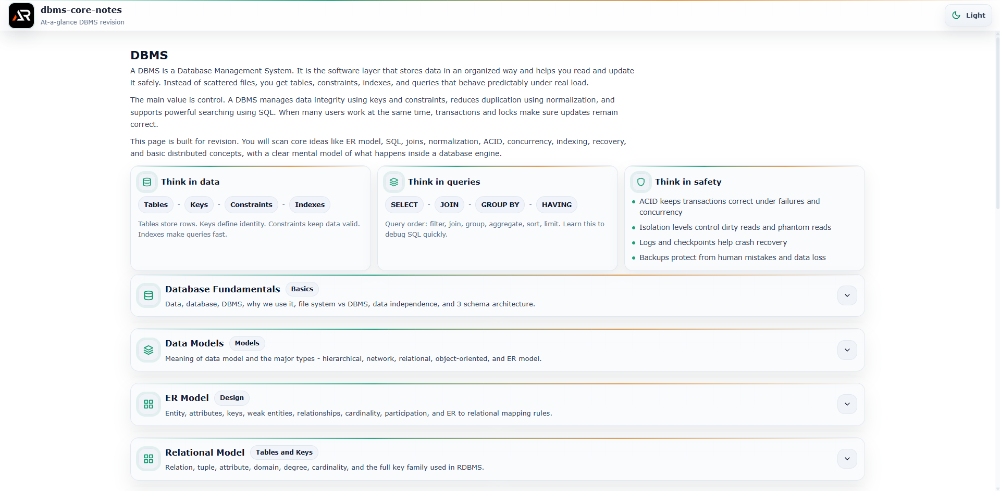

# DBMS Core Notes

A single-page, at-a-glance revision project for core Database Management System concepts.

This project is designed as a fast reference and structured summary sheet covering essential DBMS topics without unnecessary depth.  
It focuses on clarity, relational thinking, query logic, transaction behavior, and interview-ready fundamentals.

---



---

## Purpose

- Quick revision before interviews
- Rapid recall of core DBMS concepts
- Clear mental model of how data is stored, queried, and managed
- Practical, production-focused reminders
- Strong foundation in SQL, normalization, transactions, indexing, and architecture without overload

## Coverage

- What is Data
- What is a Database
- DBMS - Database Management System
- File system vs DBMS
- Advantages of DBMS
- Data independence
- Three schema architecture
    - Internal schema
    - Conceptual schema
    - External schema

- Data Models
    - Hierarchical model
    - Network model
    - Relational model
    - Entity Relationship model
    - Object-oriented model

- ER Model
    - Entity
    - Attributes
        - Simple
        - Composite
        - Multivalued
        - Derived
    - Primary key
    - Weak entity
    - Relationships
    - Cardinality
    - Participation
    - ER to relational mapping

- Relational Model
    - Relation
    - Tuple
    - Attribute
    - Domain
    - Keys
        - Super key
        - Candidate key
        - Primary key
        - Alternate key
        - Foreign key
        - Composite key

- SQL Basics
    - DDL - CREATE, ALTER, DROP
    - DML - INSERT, UPDATE, DELETE
    - DQL - SELECT
    - DCL - GRANT, REVOKE
    - TCL - COMMIT, ROLLBACK, SAVEPOINT

- SQL Querying
    - WHERE
    - AND, OR, NOT
    - BETWEEN
    - IN
    - LIKE
    - ORDER BY
    - GROUP BY
    - HAVING
    - Aggregate functions - COUNT, SUM, AVG, MIN, MAX

- Joins and Subqueries
    - INNER JOIN
    - LEFT JOIN
    - RIGHT JOIN
    - FULL JOIN
    - SELF JOIN
    - CROSS JOIN
    - Subqueries
    - Correlated subqueries
    - EXISTS

- Constraints
    - NOT NULL
    - UNIQUE
    - PRIMARY KEY
    - FOREIGN KEY
    - CHECK
    - DEFAULT

- Normalization
    - Redundancy
    - Anomalies
        - Insertion anomaly
        - Update anomaly
        - Deletion anomaly
    - Functional dependency
    - 1NF
    - 2NF
    - 3NF
    - BCNF
    - Denormalization concept

- Transactions and Concurrency
    - Transaction
    - ACID properties
        - Atomicity
        - Consistency
        - Isolation
        - Durability
    - Concurrency problems
        - Lost update
        - Dirty read
        - Non-repeatable read
        - Phantom read
    - Isolation levels
    - Locks
        - Shared lock
        - Exclusive lock
    - Two phase locking

- Indexing
    - What is index
    - Clustered index
    - Non-clustered index
    - B-Tree
    - Hash index
    - Index trade-offs

- Storage and Architecture
    - Disk storage basics
    - Pages and blocks
    - Buffer pool
    - Record storage
    - Write-ahead logging

- Query Processing and Optimization
    - Query parsing
    - Execution plan
    - Cost-based optimization
    - Index impact on performance

- NoSQL Basics
    - What is NoSQL
    - Key-value databases
    - Document databases
    - Column family databases
    - Graph databases
    - SQL vs NoSQL comparison

- Distributed Databases
    - Replication
    - Sharding
    - CAP theorem
        - Consistency
        - Availability
        - Partition tolerance
    - Eventual consistency

- Security in DBMS
    - Authentication
    - Authorization
    - Roles
    - Encryption at rest
    - Encryption in transit
    - SQL injection basics

- Backup and Recovery
    - Full backup
    - Incremental backup
    - Differential backup
    - Crash recovery
    - Log-based recovery
    - Checkpoints

- Must-know interview questions and answers

## Tech Stack

- React
- Vite
- styled-components

## Project Type

Single page only  
Section-based navigation  
Searchable and expandable content  
No blog-style content, only structured notes

Each topic is modular and collapsible for fast scanning.

## Run Locally

```bash
npm install
npm run dev
```

## Goal

Complete core DBMS knowledge in one scrollable page.

No fluff.
No repetition.
Just database-level clarity.
